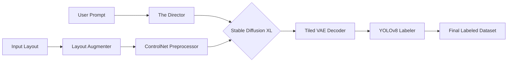

A professional `README.md` is critical—it’s the "landing page" for your code. Since you are positioning this as a startup product, the documentation should explain **what it is**, **why it's special**, and **how to run it** in one minute.

Here is the complete, professional `README.md` for **EdgeForge AI**.

### **Action: Update `README.md**`

Overwrite your existing `README.md` with the following content:

```markdown
# ⚡ EdgeForge AI

**The "Dataset Factory" for Consumer GPUs.** *Generate, Augment, and Auto-Label Synthetic Training Data locally or in the cloud.*

[](https://opensource.org/licenses/MIT)
[](https://hub.docker.com/)
[](https://huggingface.co/stabilityai/stable-diffusion-xl-base-1.0)

---

## 🚀 What is EdgeForge?

EdgeForge is a **Synthetic Data Platform** built for startups and engineers who need high-quality computer vision datasets without the high cost of manual collection.

It transforms a **single input sketch/layout** into **thousands of diverse, labeled training images**.

### **Key Features**
* **🎨 8K Quality on Consumer Hardware:** Uses **Tiled VAE & Fractional Batching** to generate 4K images on cards with as little as 8GB VRAM.
* **🏷️ Automated Annotation:** Integrated **YOLOv8** auto-labeler. Outputs standard YOLO format (`.txt`) bounding boxes instantly.
* **🏭 The Dataset Factory:** Batch generation mode produces unique variations (weather, lighting, texture) from a single prompt.
* **📐 Layout Augmentation:** Automatically shifts, scales, and multiplies objects to create geometric diversity (e.g., "1 car" → "3 cars in distance").
* **🧠 The Director:** An LLM-inspired prompt engine that expands simple intents (e.g., "rusty car") into photorealistic directives.

---

## ⚡ Quick Start (Hybrid Mode)

The easiest way to use EdgeForge is to use our hosted UI with your local GPU.

1.  **Visit the Web Interface:** Go to **[https://edgeforge-ai.vercel.app](https://edgeforge-ai.vercel.app)**
    *(Note: It will show "Engine Disconnected" initially)*

2.  **Run the Engine (Your GPU):** Open your terminal and run the Docker container. This creates a secure server on your machine.
    ```bash
    docker run --gpus all -p 8000:8000 <your_dockerhub_username>/edgeforge-ai:v1
    ```
    *(Don't have Docker? See [Manual Installation](#manual-installation-python) below)*

3.  **Generate:** Refresh the website. The status will turn **Green**. You can now generate unlimited datasets for free using your own hardware.

---

## 🛠️ Installation (Local Development)

If you want to modify the code or run offline, follow these steps.

### **Prerequisites**
* NVIDIA GPU (8GB+ VRAM recommended)
* Docker Desktop (for Container mode) OR Python 3.10+ (for Source mode)

### **Option A: Docker (Recommended)**
Build the container yourself to ensure all dependencies are locked.

```bash
# 1. Clone the repository
git clone [https://github.com/](https://github.com/)<your-username>/edgeforge-ai.git
cd edgeforge-ai

# 2. Build the image (Takes ~10 mins first time)
docker build -t edgeforge-ai .

# 3. Run it
docker run --gpus all -p 8000:8000 edgeforge-ai

```

### **Option B: Manual Python Setup**

If you don't use Docker, you can run it directly.

```bash
# 1. Install dependencies
pip install -r requirements.txt

# 2. Start the Backend Server
python -m uvicorn src.app.main:app --host 0.0.0.0 --port 8000 --reload

# 3. Start the Frontend (in a new terminal)
cd frontend
npm install
npm run dev

```

---

## 📚 Usage Guide

### **1. Single-Shot Mode (Prototyping)**

* **Best for:** Testing prompts and layouts.
* **Input:** Upload a coarse layout (e.g., white car on black background) or a Canny edge map.
* **Output:** One high-res generated image + bounding box visualization.

### **2. Batch Factory Mode (Production)**

* **Best for:** Creating the actual training dataset.
* **Batch Size:** Select 5, 10, or 50.
* **Process:** 1.  **Augment:** The engine randomly shifts/scales the input object.
2.  **Generate:** It cycles through weather conditions (Rain, Fog, Night, Snow).
3.  **Label:** It detects objects in the new images.
* **Output:** A `.zip` file containing:
* `/images` (The generated synthetic data)
* `/labels` (YOLO text files)


---

## 🏗️ Architecture

EdgeForge follows a modular "Pipeline" architecture:



* **src/efficient_diffusion_loader:** Core engine logic.
* **src/app:** FastAPI backend endpoints.
* **frontend:** React/Vite UI.

---

## 🤝 Contributing

We welcome pull requests! Please ensure you test the **Batch Generation** flow before submitting, as this is the core value proposition.

## 📄 License

This project is licensed under the MIT License - see the [LICENSE](https://www.google.com/search?q=LICENSE) file for details.

